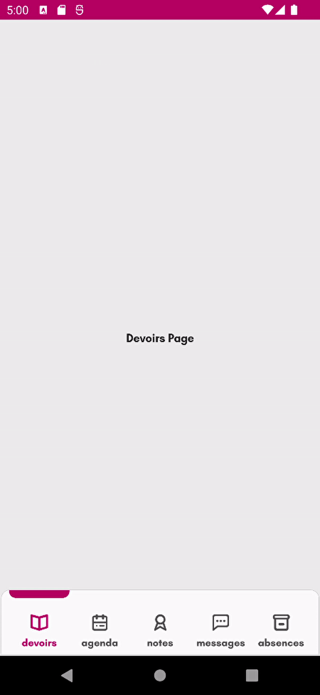
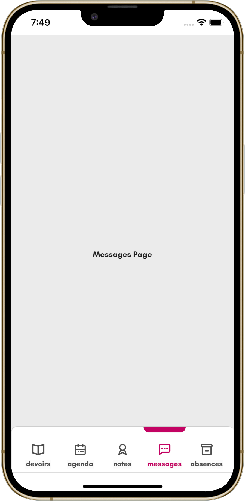
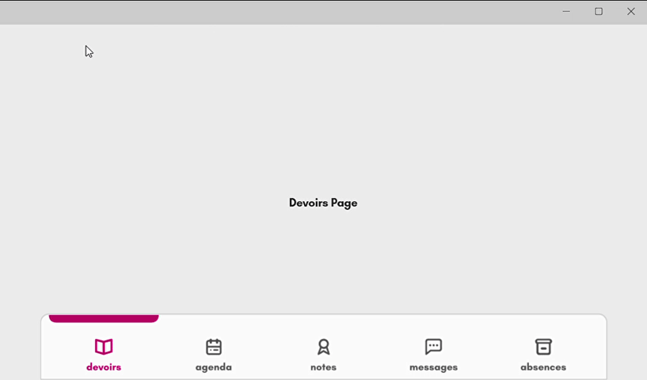

# Navbar Animation #2

## Original design

## My .NET MAUI implementation

    
    &nbsp;&nbsp;&nbsp;&nbsp;&nbsp;&nbsp;&nbsp;
    

    

### Supported platforms

These are all the platforms I have tested the app on:

- Android
- iOS (macOS)
- Windows
